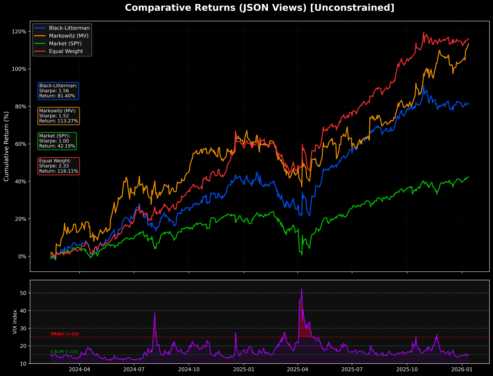

# RWA Quant Engine
[](https://www.python.org/)
[](https://github.com/astral-sh/uv)
[](LICENSE)

**RWA Quant Engine** 是一个专业的链下（Off-Chain）量化计算引擎，专为 **RWA（现实世界资产）** 美股基金设计。


该引擎采用 **Black-Litterman 模型** 作为核心算法，结合 **Google Gemini 3.0** 的多模态推理能力与 **XGBoost** 量化因子生成战术观点，并通过严苛的风控层（Risk Guardrails）输出经过审计的、可被预言机（Oracle）验证的投资组合权重。

**核心价值主张：**

1. **数学核心**：以 **Black-Litterman** 模型为基石，解决了传统 Markowitz 模型对输入敏感且容易产生极端仓位的缺陷。
    
2. **多模态观点**：支持三种观点生成模式——**人工专家 (JSON)**、**量化挖掘 (XGBoost)** 和 **AI 宏观分析 (Gemini LLM)**。
    
3. **风控优先**：内置严格的 `Gatekeeper`，执行 30% 硬顶、5% 现金缓冲 (USDC) 和碎股清理，确保链上资产安全。
    
4. **可验证性**：输出经过 EIP-191 签名的 Oracle Payload，实现了链下计算与链上结算的闭环。
    
5. **全周期验证 (新增)**：新增了专业的**回测与归因分析模块**，支持 Walk-Forward 滚动回测、VIX 市场体制分析以及多策略同台竞技。
    

---

##   System Architecture

本系统遵循 **Pipeline 模式**，从数据摄入到预言机汇报，单向流动且不可变：

```mermaid
graph LR
    A[Data Ingestion<br/>(YFinance)] --> B{Strategy Factory}
    B -->|Fundamental| C[LLM Agent<br/>Gemini + Search]
    B -->|Alpha| D[ML Predictor<br/>XGBoost + VIX]
    B -->|Static| E[Manual JSON]
    
    C & D & E --> F[Black-Litterman Core<br/>(Idzorek Method)]
    F --> G[Risk Gatekeeper<br/>(Hard Caps & Buffers)]
    G --> H[Oracle Reporter<br/>(EIP-191 Signature)]
    
    subgraph "Analysis & Research"
    F --> I[Walk-Forward Backtest]
    I --> J[Regime Analysis<br/>(Net Value vs VIX)]
    end
```


---

##  Key Features

1. **Black-Litterman Optimization**:
    
    - 使用 **Idzorek 方法** 处理观点置信度（Confidence -> Omega Matrix）。
        
    - 结合 **Ledoit-Wolf 收缩** 估算协方差矩阵，提升小样本下的稳定性。
        
2. **Professional Backtesting Suite (New!)**:
    
    - **Walk-Forward Analysis**: 支持基于滚动窗口（Rolling Window）的历史回测，杜绝未来函数。
        
    - **Multi-Strategy Comparison**: 同台竞技 **Black-Litterman**、**Markowitz (MV)**、**Equal Weight** 与 **SPY Benchmark**。
        
    - **VIX Regime Visualizer**: 专业的双面板可视化，将净值曲线与 **VIX 恐慌指数** 叠加，直观展示策略在不同市场体制下的防御能力。
        
    - **Allocation History**: 生成堆叠面积图 (Stacked Area Plot)，透视策略内部的仓位轮动与风控介入情况。
        
3. **AI & ML Strategies**:
    
    - **LLM Agent (v3.1)**: Gemini 3.0 + Google Search。采用“证据分级制度 (Scorecard)”将非结构化新闻转化为年化观点。
        
    - **ML Alpha Hunter**: 基于 **XGBoost**，融合 RSI、动量及 **VIX 波动率特征**，预测相对大盘的超额收益 (Alpha)。
        
4. **Institutional Risk Control**:
    
    - **Gatekeeper**: 强制执行单票 30% 上限与 5% USDC 现金缓冲。
        
    - **Dust Filtering**: 自动过滤 < 1% 的碎股权重，节省链上 Gas。
        
5. **Oracle Ready**:
    
    - 输出符合 **Chainlink Any API** 规范的 JSON。
        
    - 包含 **Cryptographic Signature** (EIP-191)，防止数据在传输过程中被篡改。
        

---

##   Installation

本项目使用 `uv` 进行极速依赖管理。

### 1. Prerequisites

- Python >= 3.12
    
- [uv](https://github.com/astral-sh/uv) (推荐)
    

### 2. Setup

Bash

```
# 1. 克隆仓库
git clone https://github.com/kendrickl1675/algoRWA.git
cd algoRWA

# 2. 安装依赖 (自动创建虚拟环境)
uv sync --extra dev
```

### 3. Configuration

复制 `.env.example` 为 `.env` 并填入密钥：

Ini, TOML

```
GEMINI_API_KEY="AIzaSy..."   # 用于 AI 策略
RWA_SIGNER_KEY="0x..."       # 用于预言机签名 (测试私钥)
```

---

##   Usage

### 1. 预测模式

计算**今日**的最新仓位，并生成预言机 Payload：

Bash

```
# 默认使用 Manual JSON 观点
uv run main.py --portfolio mag_seven

# 使用 AI 智能体观点
uv run main.py --portfolio mag_seven --strategy llm
```

### 2. 回测模式

启动时间机器，验证策略在历史数据上的表现。

#### A. 标准回测

模拟真实生产环境（含 30% Hard Cap 和 5% 现金缓冲）：

Bash

```
# 回测过去 3 年，使用 XGBoost 策略
uv run run_backtest.py --portfolio mag_seven --years 3 --view-source ml
```

#### B. 无约束研究模式 (Unconstrained Research)

**警告**: 关闭所有风控，仅用于观察数学模型（如 Markowitz）在极端情况下的原始行为。

Bash

```
uv run run_backtest.py --portfolio mag_seven --years 3 --view-source ml --no-risk
```

#### 输出产物 (Outcomes)

所有回测结果将自动归档至 `outcomes/` 目录，包含：

- `comparison_result.png`: **专业仪表盘** (净值曲线 + VIX 恐慌区间)。
    
- `allocation_Black-Litterman.png`: 策略持仓历史堆叠图。
    
#### Sample Output


---

##  Strategy Modules (策略模块)

|**模式**|**参数 --strategy**|**描述**|**适用场景**|
|---|---|---|---|
|**Manual**|`json`|读取 `portfolios/views.json` 中的静态观点。|回测基准、人工干预。|
|**ML Alpha**|`ml`|**XGBoost** 模型。预测 `Asset Return - SPY Return` (Alpha)，并根据 VIX 进行信号增强。|捕捉中短线超额收益。|
|**AI Agent**|`llm`|**Gemini 3.0**。提取分析师评级和财报数据，自动校准为年化收益。|捕捉基本面事件驱动。|

---

##  Project Structure (目录结构)

Plaintext

```
rwa-quant-engine/
├── outcomes/              # 回测结果自动归档 (图片/日志)
├── portfolios/            # 资产组合定义
├── src/
│   └── rwaengine/
│       ├── analysis/      # 回测与分析模块
│       ├── core/          # 核心计算
│       ├── data/          # 数据适配器
│       ├── execution/     # 风控与执行
│       ├── oracle/        # 预言机接口
│       ├── strategy/      # 策略工厂
│       └── utils/         # 工具类
├── main.py                # [预测] 程序入口
├── run_backtest.py        # [回测] 程序入口
├── pyproject.toml         # 依赖配置
└── README.md              # 项目文档
```

---

##  Disclaimer (免责声明)

本软件仅供 **研究与技术验证** 使用。

1. **非投资建议**: 生成的权重仅基于数学模型。
    
2. **模型风险**: Black-Litterman 模型对输入参数极度敏感。
    
3. **回测偏差**: 历史业绩不代表未来表现，回测可能存在幸存者偏差。
    

---

_Architected by RWA-Quant Team (2026)_