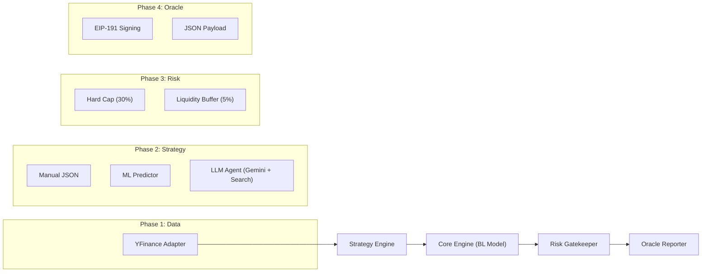

#  RWA Quant Engine (Black-Litterman)

**RWA Quant Engine** 是一个专业的链下（Off-Chain）量化计算引擎，专为 **RWA（现实世界资产）** 美股基金设计。

该引擎采用 **Black-Litterman 模型** 作为核心算法，结合 **Google Gemini 2.0** 的多模态推理能力生成战术观点，并通过严苛的风控层（Risk Guardrails）输出经过审计的、可被预言机（Oracle）验证的投资组合权重。

---

##  System Architecture (系统架构)

本系统遵循 **Pipeline 模式**，数据流向单向且不可变：



---

##  Key Features (核心特性)

1. **Black-Litterman Optimization**:
* 使用 **Idzorek 方法** 处理观点置信度（Confidence -> Omega Matrix）。
* 结合 **Ledoit-Wolf 收缩** 估算协方差矩阵，提升小样本下的稳定性。


2. **AI-Powered Strategy (v3.1)**:
* 集成 **Google Gemini 3.0 Pro** 与 **Google Search**。
* **Scorecard Pattern**: 摒弃 LLM 随机打分，采用“证据分级制度 (Tier 1/2/3)” 提取硬数据（财报、目标价）。
* **Auto-Calibration**: 自动将分析师目标价转换为 BL 模型所需的 **年化预期收益 (Annualized Returns)**。


3. **Institutional Risk Control**:
* **Gatekeeper**: 可选执行单票 30% 上限与 5% USDC 现金缓冲。
* **Dust Filtering**: 自动过滤 < 1% 的碎股权重，节省链上 Gas。


4. **Oracle Ready**:
* 输出符合 **Chainlink Any API** 规范的 JSON。
* 包含 **Cryptographic Signature** (EIP-191)，防止数据在传输过程中被篡改。


---

##   Installation (安装指南)

本项目使用 `uv` 进行极速依赖管理。

### 1. Prerequisites

* Python >= 3.12
* [uv](https://github.com/astral-sh/uv) (推荐) 或 Pip

### 2. Setup

```bash
# 1. 克隆仓库
git clone https://github.com/your-repo/rwa-quant-engine.git
cd rwa-quant-engine

# 2. 安装依赖 (自动创建虚拟环境)
uv sync --extra dev

```

### 3. Configuration (.env)

复制 `.env.example` 为 `.env` 并填入密钥：

```ini
# Google Gemini API Key (用于 AI 策略)
GEMINI_API_KEY="AIzaSy..."

# Ethereum Private Key (用于预言机数据签名)
# 测试用 (严禁使用生产钱包私钥)
RWA_SIGNER_KEY="0x..."

```

---

##  Usage (使用指南)

### 1. 运行标准流程 (Standard Run)

使用默认策略（JSON 配置）和风控：

```bash
uv run main.py --portfolio mag_seven

```

### 2. 运行 AI 策略 (AI Strategy)

启用 Gemini 智能体进行联网分析：

```bash
uv run main.py --portfolio mag_seven --strategy llm

```

* **输入**: `portfolios/portfolios.json` 定义的资产池。
* **输出**: 控制台日志 + `oracle_output_{name}.json`。
* **审计**: 查看 `debug_views_{name}.json` 获取 AI 的思考过程。

### 3. 研究模式 (Research Mode)

**警告**: 此模式会关闭所有风控（30% Cap, Cash Buffer），仅用于查看数学模型的理论最优解。

```bash
uv run main.py --portfolio mag_seven --strategy llm --no-risk

```

---

##  Strategy Modules (策略模块详解)

系统支持三种策略模式，通过工厂模式 (`StrategyFactory`) 动态切换：

| 模式 | 参数 `--strategy` | 描述                                                | 适用场景 |
| --- | --- |---------------------------------------------------| --- |
| **Manual** | `json` | 读取 `portfolios/views.json` 中的静态观点。                | 回测、调试、人工干预。 |
| **Machine Learning** | `ml` | 使用 XGBoost/RandomForest 基于量价因子预测。                 | 短线量化、因子挖掘。 |
| **AI Agent** | `llm` |  Gemini 3.0 + Google Search。提取分析师评级和财报数据。 | 捕捉宏观情绪、基本面事件。 |

### LLM Scorecard Logic (v3.1)

AI 代理不直接生成权重，而是填写一份 **评分卡**：

* **Tier 1 (High)**: 确凿的硬数据（如财报超预期、SEC文件）。置信度映射为 **0.95**。
* **Tier 2 (Med)**: 机构评级（如高盛上调目标价）。置信度映射为 **0.80**。
* **Tier 3 (Low)**: 市场传言。直接丢弃。

---

##  Risk Guardrails (风控机制)

`PortfolioRiskManager` 是系统的最后一道防线：

1. **Dust Cleaner**: 清除权重 < 1% 的资产。
2. **Hard Cap**: 任何单一资产权重 > 30% 及其溢出部分，**强制削减**。
3. **Liquidity Injection**: 被削减的权重与预留的 5% Buffer 一起注入 **USDC**。
4. **Normalization**: 确保最终 `Sum(Assets) + USDC = 100%`。

---

##   Project Structure (目录结构)

```text
rwa-quant-engine/
├── configs/               # (Legacy) 旧配置目录
├── portfolios/            # 资产组合定义 (JSON)
│   ├── portfolios.json    # 资产池
│   └── views.json         # 手动观点
├── src/
│   └── rwaengine/
│       ├── core/          # 核心计算 (BL Model)
│       ├── data/          # 数据适配器 (YFinance)
│       ├── execution/     # 风控与执行 (Risk Manager)
│       ├── oracle/        # 预言机接口 (NAV Reporter)
│       ├── strategy/      # 策略工厂
│       │   ├── generators/# 具体策略实现 (LLM, ML, Manual)
│       │   └── factory.py # 工厂类
│       └── utils/         # 工具类
├── tests/                 # Pytest 测试用例
├── main.py                # 程序入口
├── pyproject.toml         # 依赖配置
└── README.md              # 项目文档

```

---

##   Disclaimer (免责声明)

本软件仅供 **研究与技术验证** 使用。

1. **非投资建议**: 生成的投资组合权重仅基于数学模型，不构成任何财务建议。
2. **API 风险**: 依赖第三方数据源 (Yahoo Finance, Google Search)，可能存在数据延迟或中断。
3. **模型风险**: Black-Litterman 模型对输入参数（特别是 $\Pi$ 和 $Q$）极度敏感，需谨慎校准。

---

*Architected by RWA-Quant Team (2026)*